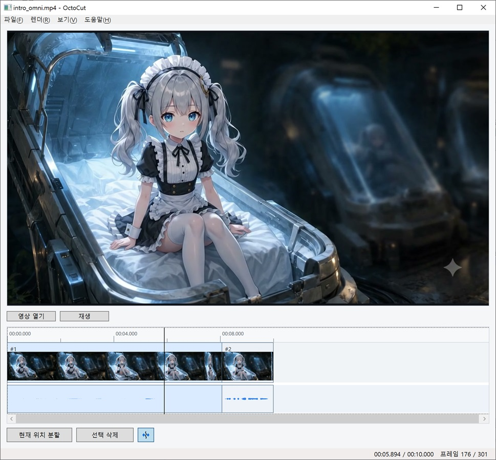

# OctoCut

[](docs/images/octocut-preview.png)

OctoCut은 .NET 10 WPF 기반의 간이 영상 편집 도구입니다. 영상을 타임라인에 이어 붙이고, 클립을 분할하거나 삭제한 뒤 FFmpeg로 결과물을 렌더링하는 MVP를 목표로 합니다.

## 구현된 기능

- 여러 영상 파일 열기
  - 새로 여는 영상은 기존 타임라인의 뒤에 이어 붙습니다.
- 편집기 스타일 타임라인
  - 분할 후 원본 기준이 아니라 분할된 클립들이 이어진 편집 타임라인으로 동작
  - 선택 클립을 `앞으로 보내기` / `뒤로 보내기` 버튼으로 한 칸씩 순서 조정
  - 첫 번째 클립은 `앞으로 보내기`, 마지막 클립은 `뒤로 보내기` 버튼이 비활성화됩니다.
  - 같은 순서에서 앞 클립과 겹치게 드래그하면 겹친 구간은 디졸브 전환으로 렌더링됩니다.
  - 선택 클립이 앞뒤 클립과 겹친 상태면 `전환효과 해제` 버튼으로 양쪽 디졸브 전환을 한 번에 해제할 수 있습니다.
  - 드래그로 클립 순서를 바꾸지는 않습니다. 순서 변경 후에는 클립들이 빈틈 없이 다시 붙습니다.
  - 시간 눈금 영역에서 마우스 휠을 굴리면 타임라인 스케일을 확대/축소할 수 있습니다.
  - 썸네일/오디오 트랙 영역에서 마우스 휠을 굴리면 현재 프레임은 유지한 채 타임라인 보기 위치만 좌우로 스크롤합니다.
  - 시간 눈금, 썸네일 트랙, 오디오 파형 미리 보기 표시
  - 현재 위치는 1px 세로선으로 표시
- 현재 타임라인 위치에서 클립 분할
- 선택한 클립 삭제
- 잔물결 삭제 옵션
  - 기본값은 켜짐
  - 켜져 있으면 삭제로 생긴 빈 구간을 뒤 클립이 앞으로 당겨 붙여 메웁니다.
- 하단 상태 영역에 현재 시간, 전체 시간, 현재 프레임 번호, 전체 프레임 수 표시
- 현재 프레임 캡처
  - `F12`로 현재 프레임을 원본 영상 해상도 PNG 이미지로 추출해 클립보드에 복사
  - `File > 현재 프레임 파일로 저장` 메뉴에서 PNG 파일로 저장
- 현재 프레임 미리보기
  - 재생 버튼 오른쪽의 `미리보기` 체크박스는 기본으로 켜져 있습니다.
  - 켜져 있으면 정지 상태에서 전환 구간을 탐색할 때 현재 프레임에 디졸브 전환 상태를 반영해 보여줍니다.
  - 표시용 프레임은 다운스케일해 최근 프리뷰를 메모리에 캐시하며, 캐시는 최대 100개 또는 256MB 안에서 유지됩니다.
- `보기 > 디버그 로그 보기` 토글 메뉴
  - 일반 화면에는 로그 메시지를 표시하지 않습니다.
  - 토글을 켜면 별도 창에서 내부 작업 로그를 확인할 수 있습니다.
- 다국어 UI
  - 기본 제공 언어: 한국어, English, 日本語, 简体中文, 繁體中文
  - 언어 설정 저장 이력이 없으면 최초 실행 시 OS 언어를 감지해 자동 선택하고 저장합니다.
  - 이후 실행부터는 저장된 언어를 계속 사용하며, `File > Settings`에서 변경할 수 있습니다.
  - `Languages` 폴더에 같은 구조의 JSON 언어 파일을 추가하면 설정의 언어 목록에 표시됩니다.
  - 언어 선택 목록의 언어 이름은 각 언어의 자체 표기(`nativeName`)를 그대로 사용하며 번역 대상이 아닙니다.
- FFmpeg 기반 렌더링
  - 무인코딩 렌더: 같은 원본의 시작부터 끊김 없이 이어지고 전환이 없는 경우 FFmpeg stream copy로 새 인코딩 없이 렌더링
  - 인코딩 렌더: 여러 원본, 잘라낸 구간, 디졸브 전환을 포함해 H.264/AAC로 새 출력 파일 생성
  - 인코딩 렌더의 해상도와 프레임레이트는 첫 번째 클립의 원본 영상 값을 기준으로 맞춥니다.
- FFmpeg 필수 실행 조건
  - 경로가 설정되어 있지 않고 자동 탐색도 실패하면 시작 시 안내 창 표시
  - WinGet 설치, 공식 다운로드 페이지 열기, 수동 경로 지정 지원
  - FFmpeg가 끝내 준비되지 않으면 앱은 종료됩니다.
- `File > Settings` 메뉴에서 FFmpeg 경로 변경
- `도움말 > 단축키` 메뉴에서 단축키 안내

## 사전 준비

- .NET 10 SDK
- FFmpeg
  - OctoCut 실행과 렌더링에 필요합니다.
  - `PATH`에 등록하거나 앱 설정에서 `ffmpeg.exe` 경로를 직접 지정할 수 있습니다.
  - 최초 실행 시 FFmpeg를 찾지 못하면 안내 창에서 WinGet 설치 또는 수동 경로 지정을 선택할 수 있습니다.

## 언어 파일 확장

언어 파일은 실행 파일 옆의 `Languages` 폴더에 있는 JSON 파일입니다. 새 언어를 추가하려면 기존 파일을 복사해 `code`, `nativeName`, `strings` 값을 채우면 됩니다.

```json
{
  "code": "en-US",
  "nativeName": "English",
  "strings": {
    "Main.Button.OpenVideo": "Open Video"
  }
}
```

앱은 누락된 문자열을 기본 언어인 한국어에서 찾아 사용합니다.

## 기본 사용법

1. OctoCut을 실행합니다.
2. 영상을 엽니다. 영상을 더 열면 타임라인 끝에 추가됩니다.
3. 타임라인에서 원하는 위치로 이동합니다.
4. `S` 키 또는 분할 버튼으로 현재 위치에서 클립을 나눕니다.
5. 클립 순서는 `앞으로 보내기` / `뒤로 보내기` 버튼으로 조정하고, 드래그는 앞 클립과 겹치는 디졸브 전환 구간을 만들 때 사용합니다.
6. 선택 클립의 앞뒤 전환을 없애려면 표시되는 `전환효과 해제` 버튼을 누릅니다.
7. 전환 상태까지 포함한 현재 프레임을 보고 싶으면 재생 버튼 오른쪽의 `미리보기` 체크를 켭니다.
8. 삭제할 클립을 선택하고 `Delete` 키 또는 삭제 버튼으로 삭제합니다.
9. 잔물결 삭제가 켜져 있으면 삭제된 구간만큼 뒤 클립이 앞으로 당겨져 이어집니다.
10. 렌더 메뉴에서 무인코딩 또는 인코딩 렌더를 선택해 결과물을 저장합니다.

## 단축키

- `Enter`: 재생 / 일시정지
- `Space`: 현재 위치에서 재생을 시작하고, 다시 누르면 재생 시작 위치로 돌아가 정지
- `S`: 현재 위치에서 클립 분할
- `Delete`: 선택 클립 삭제
- `Left` / `Right`: 이전 / 다음 프레임으로 이동
- `F12`: 현재 프레임을 클립보드로 복사

## 프로젝트 구조

- `OctoCut.sln`: 솔루션 파일
- `OctoCut/`: WPF 애플리케이션 프로젝트
- `README.md`: 프로젝트 개요와 사용 안내
